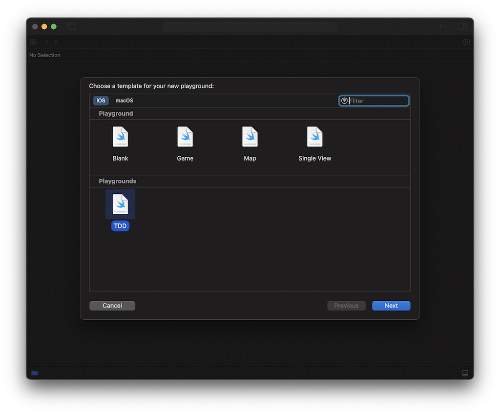

# What?

Yeah, because TDD is awesome.

And it makes solving LeetCode problems easier. Every test case you fail on LeetCode becomes a new unit test!




# How to Install

1. Download TDD.xctemplate
2. Move TDD.xctemplate to the following folder:

```text
~/Library/Developer/Xcode/Templates/File Templates/Playgrounds
```

3. Start a new Playgrounds in Xcode.
